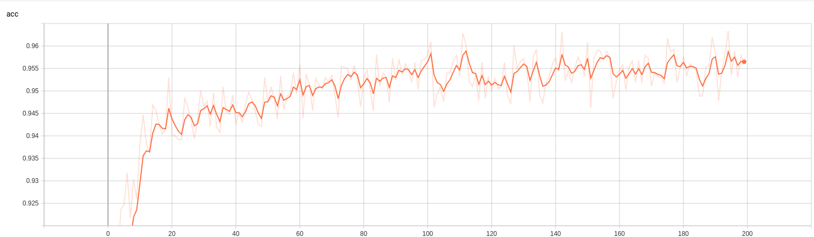
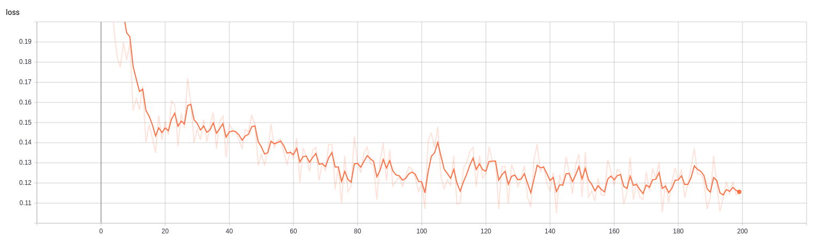
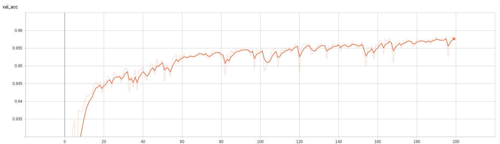

# sentiment-analyzer

This repo contains project which aim is to create NN intended to recognize sentiment of provided reviews. 
All scripts were written in python using such libraries as keras, gensim and nltk.

## How to use?

First of all place reviews files in project directory. Run script train_embedding.py by typing in terminal: 
>python3 train_embedding.py -d "names of files containing reviews separated by a space"

This script will generate all necessery files in project directory. To start NN training type in terminal:
>python3 train_network.py

This script will generate model checkpoints as ".hdf5" files and training logs which will be saved in folder called "logs" by default. 

After that manual_test.py allows to perform some tests on trained gensim and NN models.

All mentioned scripts allows to modify some program parameters from terminal by using argparse python library.

## Training logs:

### Accuracy:

### Loss:

### Validation accuracy:

### Validation loss:

